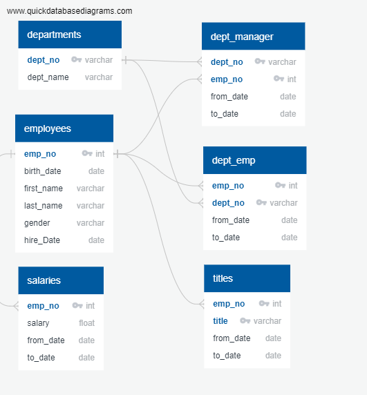
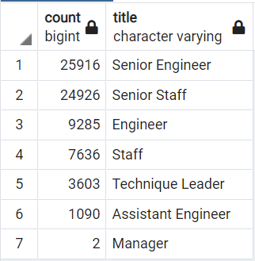

# Pewlett Hackard Analysis
Module 7 Classwork - PostgreSQL

## Overview of Analysis

This analysis is to determine the number of employees eligible for retirement, and the titles that they hold. Identifying the employees eligible to leave the company will help PH plan for the future, and hire the right incoming candidates.

Additionally, mentors are identified for specific positions to help with onboarding.

## Results

- An entity relationship diagram (ERD) of the data is shown below:

- Per the below table, the positions which will be msot impacted are Senior Engineers and Senior Staff positions, with over 20,000 employees leaving each job class

- As shown in the ERD; the data model has several one-to-many relationships. This complicated queries as one employee may have held multiple titles across multiple departments. 

- 1549 employees were flagged as potential mentors

- The number of new hires greatly outweighs the number of eligible mentors

## Summary

Around 72,000 employees are expected to retire soon, primarily Senior Engineers and Senior Staff members. Around 1500 employees were identified as eligible for mentorship positions. 

Based on this analysis, there are not enough mentors to satisfy all of the new hires which are expected. 

Further analysis could be completed to determine the number of mentors available for each title, and how many more mentors might be available if the eligibility criteria were widened.

Additionally, tables could be created with just the active title and department for each employee to simplify the query process in the future.